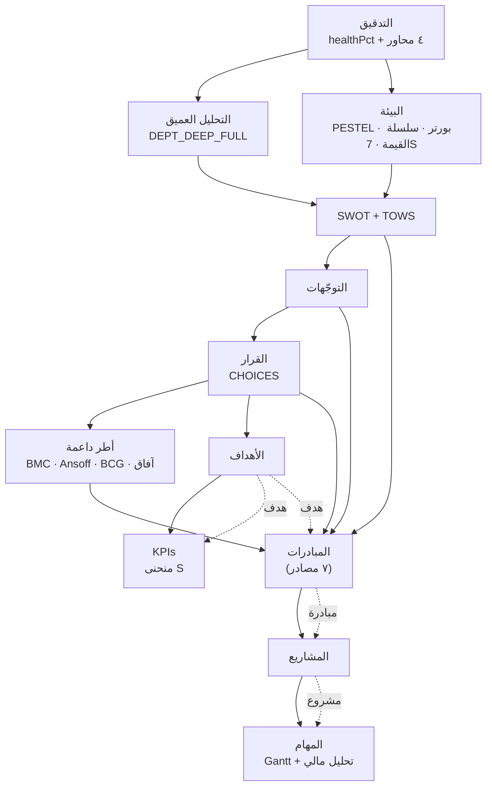

# 🧭 رحلة العميل في STARTIX — فلوشارت

> كل عميل = شركة مستقلّة ببياناته المعزولة (`companyId`)، وكل الأدوات تشتغل عليه عبر `?client={companyId}`.
> المراحل **مقفولة بالتسلسل**: كل مرحلة تفتح الي بعدها، ومخرجات كل مرحلة تصير مدخلات للي تليها.

---

## المخطط الكامل (Flowchart)

```mermaid
flowchart TD
    %% ===== المسار العام (مرة وحدة) =====
    subgraph GEN["🏁 المسار العام — مرة وحدة"]
        direction TB
        G1["📝 التسجيل<br/>/join<br/>← تخصّص المدير (١٣ إدارة)"]
        G2["🎯 اختيار المسار<br/>/settings/path<br/>← strategyPath: QUICK/MEDIUM/LONG"]
        G3["👥 إضافة عميل<br/>/manager/clients<br/>← companyId (بيانات معزولة)"]
        G1 --> G2 --> G3
    end

    G3 ==> S1

    %% ===== مسار العميل (٨ مراحل) =====
    S1["🟦 ١ · التدقيق الأساسي<br/>/{dept}/audit<br/>١٢ سؤال · ٤ محاور (حوكمة/مالية/فريق/رقمي)<br/>⇒ healthPct + منطقة الخطر"]

    S2["🟣 ٢ · التحليل العميق (اختياري)<br/>/manager/deep-analysis<br/>سريع ٤ + موسّع ٦٠ سؤال · ٦ أنواع<br/>⇒ DEPT_DEEP_FULL"]

    S3["🟢 ٣ · تحليل البيئة<br/>/manager/dept-pestel<br/>PESTEL + بورتر + سلسلة القيمة + 7S<br/>⇒ PESTEL / PORTER / VALUE_CHAIN / INTERNAL_ENV"]

    S4["🟡 ٤ · التوليف: SWOT + TOWS<br/>/swot · /tows<br/>يعبّي من ٤ مصادر تلقائياً + Claude اختياري<br/>⇒ SWOT + TOWS (SO/WO/ST/WT)"]

    S5["🟠 ٥ · التوجّه والقرار<br/>/directions · /choices<br/>خوارزمية ذكية ٠–١٠٠ + تثبيت القرار 🔒<br/>⇒ DIRECTIONS + CHOICES + BMC/Ansoff/BCG/آفاق"]

    S6["🟩 ٦ · المؤشرات والأهداف<br/>/kpis · /objectives · /bsc<br/>KPIs من البنك + منحنى S + أهداف SMART<br/>⇒ Objective / OKR / KPI / KPIEntry"]

    S7["🟧 ٧ · المبادرات وترتيب الأولويّات<br/>/initiatives<br/>ولّد من ٧ مصادر + حارس الميزانية<br/>⇒ Initiative (priority/level/cost)"]

    S8["🟥 ٨ · التنفيذ والمتابعة<br/>/projects · /gantt-chart<br/>مبادرة→مشروع→٢–٤ مهام + Gantt + تحليل مالي<br/>⇒ Project + Task"]

    S1 -->|"يفتح الأدوات"| S2
    S2 --> S3
    S3 -->|"يصبّ في"| S4
    S4 -->|"استراتيجيات → اتجاهات"| S5
    S5 -->|"القرار → أرقام"| S6
    S6 -->|"أهداف/KPIs → مبادرات"| S7
    S7 -->|"مبادرات → مشاريع"| S8

    S8 ==> DONE(["✅ تنفيذ + متابعة دوريّة<br/>(قياسات KPI ترجع تغذّي المتابعة)"])

    %% ===== حلقة المتابعة =====
    DONE -. "قياس دوري (KPIEntry)" .-> S6

    %% ===== ألوان =====
    classDef gen fill:#e0f2fe,stroke:#0369a1,color:#0c4a6e;
    classDef stage fill:#f8fafc,stroke:#475569,color:#0f172a;
    classDef done fill:#dcfce7,stroke:#16a34a,color:#14532d;
    class G1,G2,G3 gen;
    class S1,S2,S3,S4,S5,S6,S7,S8 stage;
    class DONE done;
```

---

## الجسر الاستراتيجي (تسلسل البيانات — Data Lineage)

---

## تفصيل كل مرحلة

| # | المرحلة | المسار | المخرجات (Artifact/جدول) | AI؟ |
|---|---------|--------|--------------------------|-----|
| — | 📝 التسجيل | `/join` | تخصّص المدير | — |
| — | 🎯 اختيار المسار | `/settings/path` | `strategyPath` | — |
| — | 👥 إضافة عميل | `/manager/clients` | `companyId` | — |
| 1 | 🟦 التدقيق الأساسي | `/{dept}/audit` | `DeptAudit` (healthPct + منطقة خطر) | — |
| 2 | 🟣 التحليل العميق *(اختياري)* | `/manager/deep-analysis` | `DEPT_DEEP_ANSWERS` · `DEPT_DEEP_FULL` | — |
| 3 | 🟢 تحليل البيئة | `/manager/dept-pestel` | `PESTEL_<DEPT>` · `PORTER_<DEPT>` · `VALUE_CHAIN_<DEPT>` · `INTERNAL_ENV` | ✨ PESTEL |
| 4 | 🟡 التوليف SWOT+TOWS | `/swot` · `/tows` | `SWOT` (+`tows`) | ✨ TOWS اختياري |
| 5 | 🟠 التوجّه والقرار | `/directions` · `/choices` | `DIRECTIONS` · `CHOICES` · `BMC` · `ANSOFF` · `BCG` · `THREE_HORIZONS` | ✨ مبرّر القرار |
| 6 | 🟩 المؤشرات والأهداف | `/kpis` · `/objectives` · `/bsc` | `Objective` · `OKR` · `KPI` · `KPIEntry` | ✨ توليد KPIs |
| 7 | 🟧 المبادرات | `/initiatives` | `Initiative` | ✨ من ٧ مصادر |
| 8 | 🟥 التنفيذ والمتابعة | `/projects` · `/gantt-chart` | `Project` · `Task` | ✨ توليد المشاريع |

### تفاصيل مفتاحية
- **التدقيق:** مقياس ٤ نقاط (٠–٣) · أوزان المحاور: حوكمة ٣٠ / مالية ٣٠ / فريق ٢٠ / رقمي ٢٠ · `healthPct = المجموع÷١٠٠` · مناطق الخطر: 🟢≥٧٥ · 🟡٥٠–٧٤ · 🟠٢٥–٤٩ · 🔴<٢٥.
- **SWOT يعبّي من ٤ مصادر:** PESTEL (فرص/تهديدات) · التحليل العميق (قوة/ضعف) · تحليل الفجوة (قوة/ضعف) · التشخيص. كل بند يحمل: 🤖 المصدر · 📍 الرابط · 💡 السبب.
- **خوارزمية القرار (٠–١٠٠):** الأساس (جدوى×أثر ٠–٤٠) + الدعم (٠–٢٠) − خصم المخاطر (١٥) + مكافأة TOWS (١٠) + مطابقة المسار (١٥).
- **المبادرات — ٧ مصادر:** ⭐القرار · TOWS · التوجّهات · Ansoff · الآفاق الثلاثة · 🚨سجل المخاطر · 🎯آيزنهاور. إزالة تكرار بـ`titleKey` + تعزيز حسب المسار + حارس ميزانية (`Σ التكلفة` مقابل `opex.budget`).
- **المشاريع:** مدّة تلقائية = أساس المسار (٦٠/٩٠/١٨٠) ± الأفق ± الأولويّة · جدولة متسلسلة (الحرِج اليوم، العالي +٧، المتوسّط +١٥) · تحليل Dupont ROE + محاكاة Monte Carlo بسياق سعودي (GOSI/إقامة/تأمين).

### ملاحظة الأدوار
أدوات `/owner/*` يستخدمها المالك على مستوى الشركة كاملة، ونفسها يستخدمها المدير المستقل (INDEPENDENT_PRO) لكن **مقصورة على إدارته** — بـ artifacts بلاحقة `_<DEPT>` مثل `BMC_SALES`, `ANSOFF_HR`.
